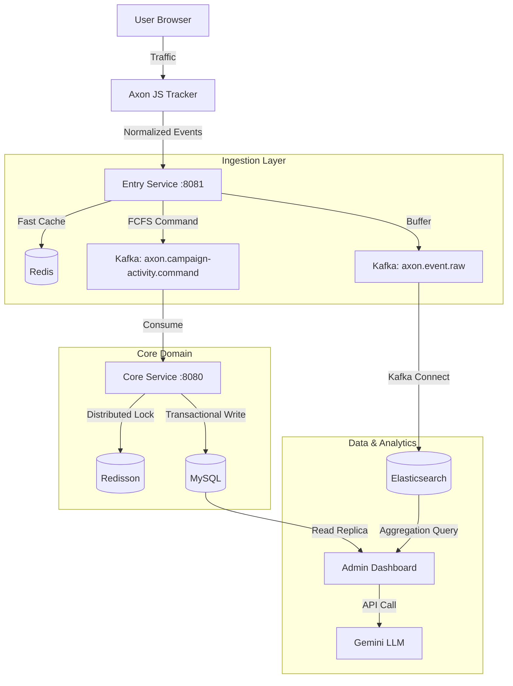
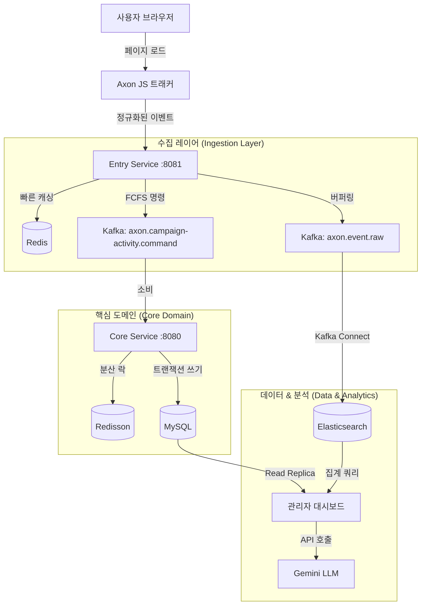

# Axon: Customer Data Platform for Marketing Intelligence

**Languages**: [English](#english) | [한국어](#korean)

---

<a name="english"></a>
## 🌎 English Version

> **Scale-ready, Event-driven Architecture for High-Concurrency Commerce & Real-time Marketing Analytics**

Axon CDP transforms every user behavior (event participation, purchases, clicks, scrolls) in e-commerce into valuable marketing insights. Built for **massive traffic spikes** (FCFS events, flash sales), it ensures **data consistency** under high concurrency while providing real-time dashboards for marketers.

---

## 🎯 Key Features

### 1. High-Concurrency Event Processing
- **Deterministic FCFS**: Guarantees zero over-booking using **Redisson Distributed Locks** and **Redis Atomic Counters**
- **2-Stage Token System**: Reservation token → Payment confirmation workflow prevents double bookings
- **Spike Buffering**: Entry Service absorbs traffic bursts and buffers to Kafka before reaching core logic

### 2. Real-time Behavior Tracking
- **Lightweight JS Tracker**: Collects page views, clicks, scrolls without impacting site performance
- **No-ETL Pipeline**: Client-side data normalization eliminates server-side parsing overhead
- **Instant Indexing**: Kafka Connect streams events to Elasticsearch in sub-second latency

### 3. Advanced Marketing Dashboard
- **Funnel Analysis**: Visualizes conversion rates from Visit → Click → Purchase
- **Cohort & LTV Analysis**: Tracks user retention, lifetime value (30d/90d/365d), and CAC metrics
- **Real-time Widgets**: Live inventory, participant count, conversion rate updates

### 4. LLM-Powered Marketing Assistant
- **Context-Aware AI**: Gemini-based chatbot understands current campaign context
- **Safe Data Access**: Uses verified dashboard APIs instead of risky SQL generation
- **Actionable Insights**: Generates hypothesis-driven recommendations (e.g., "High page views but low conversion suggests price resistance — try limited-time 15% coupon popup")

---

## 🏗️ System Architecture



| Module | Responsibility | Tech Stack |
|--------|----------------|------------|
| **`entry-service`** | Traffic gateway, FCFS validation, behavior logging | Spring Boot, Netty, Redis, Kafka |
| **`core-service`** | Business logic, domain persistence, analytics | Spring Boot (Virtual Threads), JPA, Redisson, Spring Batch |
| **`common-messaging`** | Shared DTOs, Kafka topics, domain events | Java Library |
| **`infrastructure`** | K8s manifests, Helm charts, CI/CD | Docker, GitHub Actions |
| **`axon-tracker`** | Lightweight JS SDK for behavior tracking | Vanilla JS (< 5KB gzipped) |

---

## 🛠️ Tech Stack

**Backend**:
- Java 21 (LTS), Spring Boot 3.5.5, Spring Batch, Spring Security
- Apache Kafka (KRaft mode), MySQL 8.0, Redis (Cluster-ready), Elasticsearch 8.x

**DevOps**:
- Kubernetes (K8s), Docker, GitHub Actions, KT Cloud, Nginx Ingress

**Observability**:
- Prometheus, Grafana, Kibana, Fluentbit

**Frontend**:
- Thymeleaf, Chart.js, TailwindCSS, Vanilla JS

**AI/ML**:
- Gemini 2.0 Flash (Marketing Intelligence)

---

## 🚀 Getting Started

### Prerequisites
- Java 21+
- Docker & Docker Compose

### 1. Start Infrastructure
Spin up Kafka, MySQL, Redis, Elasticsearch, and supporting services.
```bash
docker-compose up -d
```

### 2. Run Services
**Entry Service (Port 8081)**
```bash
./gradlew :entry-service:bootRun
```

**Core Service (Port 8080)**
```bash
./gradlew :core-service:bootRun
```

### 3. Access Dashboard
Navigate to `http://localhost:8080/admin/dashboard/1` to view the real-time marketing dashboard.

---

## 🧪 Testing & Simulation

Axon includes a powerful simulation suite for complex scenarios.

| Script | Purpose |
|--------|---------|
| `run-dashboard-test.sh` | Generates full user journey (Visit → Purchase) and populates dashboard |
| `generate-ltv-simulation.sh` | Simulates future repurchases (30d/90d/365d) for Cohort/LTV analysis |
| `time-travel-activity.sh` | Moves campaign dates to the past to test expired scenarios |
| `generate-full-funnel.sh` | Core script for behavior event + FCFS reservation workflow |

**Example: Full Test Run**
```bash
# Generate 100 visitors for Activity ID 1
./core-service/scripts/run-dashboard-test.sh 1 100

# Simulate LTV for 30-day cohort
./core-service/scripts/generate-ltv-simulation.sh 1
```

---

## ⚡ Performance Engineering

### Concurrency Control
We addressed **"Over-booking"** in FCFS events by implementing **Redisson Distributed Locks**.
- **Before**: Database `check-then-act` caused race conditions under load
- **After**: `RLock` ensures atomic reservations across distributed instances
- **Result**: Zero over-booking even under 8,000 concurrent users

### Throughput Optimization
- **Virtual Threads (JDK 21)**: Replaced complex reactive chains with blocking-style Virtual Threads
  - 8x throughput improvement with 99% code reuse (vs WebFlux rewrite)
  - Simpler debugging compared to Reactor stack traces
- **Async Event Publishing**: `@ApplicationEvent` + Kafka ensures main transaction is never blocked by logging

### Batch Processing
Axon combines **`@Scheduled`** and **Spring Batch** for heavy analytics:
- `@Scheduled` triggers jobs periodically (e.g., every 100 minutes)
- Spring Batch processes large datasets in chunks (100 rows per transaction)
- Example: `UserPurchaseScheduler.java` → `BatchConfig.java` (Reader-Processor-Writer pattern)

---

## 📊 Data Architecture

### Hybrid Query Engine
- **MySQL (Read Replica)**: Transactional data (purchases, user profiles) for accurate financial metrics
- **Elasticsearch**: Massive behavior logs (page views, clicks) for real-time aggregation
- **Redis**: FCFS counters, reservation tokens, campaign metadata caching (1-hour TTL)

### Real-time Streaming Pipeline
```
Browser (Tracker) → Entry Service → Kafka → Kafka Connect → Elasticsearch
                                  ↓
                             Core Service → MySQL
```
- **Kafka Connect**: Streams `axon.event.raw` to Elasticsearch with < 1s latency
- **No-ETL Design**: Tracker sends pre-normalized JSON schema, eliminating server-side parsing

---

## 📈 Marketing KPIs Provided

- **Funnel Conversion**: Visit → Click → Reservation → Purchase (%)
- **Cohort Analysis**: Retention rates (D1, D7, D30) and LTV by acquisition date
- **CAC (Customer Acquisition Cost)**: Campaign spend / new users
- **ROAS (Return on Ad Spend)**: Revenue / ad spend
- **Real-time Metrics**: Current participants, remaining inventory, conversion velocity

---

## 🤖 LLM Marketing Intelligence

**Example Interaction**:
> **Marketer**: "Recent signups increased but repurchase rate is low. How to turn them into loyal customers?"

> **Axon AI**:
> - **Cohort Analysis**: Last month's "Fall Sale" cohort has only 12% D30 retention (avg: 25%). First purchase < ₩30,000 → low repurchase probability.
> - **Action Items**:
>   1. Send "₩5,000 off + free shipping" coupon within 3 days post-purchase (predicts 2.5x LTV increase)
>   2. Show "₩10,000 more for VIP perks" message at checkout to increase AOV
>   3. Send personalized email with trending keywords ("knit", "coat") to at-risk segments

**How It Works**:
1. **Safe Tool Use**: LLM calls verified dashboard APIs (no raw SQL injection risk)
2. **Context Awareness**: Auto-detects current campaign ID and timeframe
3. **Domain Knowledge**: Marketing-specific prompts generate hypothesis-driven insights

---

## 📚 Documentation

- [Performance Improvement Plan](docs/performance-improvement-plan.md)
- [Behavior Tracker Specification](docs/behavior-tracker.md)
- [Marketing Dashboard Development](docs/marketing-dashboard-development-plan.md)
- [Campaign Activity Flow](docs/campaign-activity-limit-flow.md)

---

## 🏆 Key Achievements

✅ **Zero Over-booking**: Distributed locking ensures 100% inventory accuracy under 8,000 concurrent users
✅ **Sub-second Analytics**: Elasticsearch aggregation queries return in < 200ms
✅ **8x Throughput**: Virtual Threads handle 8,000+ req/s vs 1,000 req/s (platform threads)
✅ **High Availability**: 2+ replicas for all critical services (Kafka, MySQL, Redis)
✅ **Auto-scaling**: HPA triggers scale-out when CPU > 70%

---

**Axon Team** | *Built for Scale, Designed for Insight.*

---
---

<a name="korean"></a>
## 🇰🇷 한국어 버전

> **대용량 트래픽 환경에서도 안정적인 고객 데이터 플랫폼**

Axon은 쇼핑몰 내에서 발생하는 모든 사용자 행동(이벤트 참여, 구매, 클릭, 스크롤 등)을 수집하고 분석하여, 가치 있는 데이터로 가공합니다. 데이터를 이용한 마케팅 의사결정을 지원하는 **고객 데이터 플랫폼(CDP)**입니다.

백엔드 중점 설계로 대규모 트래픽 환경에서도 **서비스 안정성(OLTP)**과 **분석 성능(OLAP)**을 동시에 확보하는 아키텍처를 설계했습니다. 성능 최적화와 데이터 정합성을 깊이 있게 고민하였으며, 이를 통해 마케터에게 실질적인 비즈니스 인사이트를 제공합니다.

---

## 🎯 핵심 기능

### 1. 고동시성 이벤트 처리
**"선착순, 추첨 등 폭주하는 트래픽을 안정적으로 받아냅니다."**

- **Redis 기반 2단계 토큰 시스템**: 선착순/응모 이벤트의 대량 트래픽 상황에서도 데이터 무결성 보장 및 안정적 재고 관리
- **분산 락(Redisson)**: 멀티 쓰레드 환경에서 동시성 문제를 차단하여 중복 참여 방지
- **부하 분산을 위한 서버 분리**: Entry Service가 트래픽을 받고, Kafka를 통해 Core Service로 메시지 전달
- **Virtual Thread 기반 고성능 처리**: Java 21 Virtual Thread로 기존 스레드 모델 대비 수천 배 많은 동시 접속 처리
- **고가용성**: 최소 2개 이상의 인스턴스로 서버 다운 방지 (Kafka, Redis, MySQL)
- **수평적 Auto-Scaling**: 트래픽 몰릴 때 자동으로 파드 스케일 아웃

### 2. 실시간 행동 추적
**"순도 높은 고객 행동 데이터를 사이트 성능 저하 없이 수집합니다."**

- **경량 JS 트래커(Axon SDK)**: 페이지 뷰, 클릭 데이터를 수집하여 Elasticsearch에 실시간 적재
- **ETL 최소화 (No-ETL)**: 브라우저에서 표준 JSON 스키마로 변환하여 전송 → 서버는 별도 파싱 없이 바로 DB/Elasticsearch로 흘려보냄 (Pass-through)
- **백엔드 성능 최적화**: 데이터 검증 및 정제 책임을 클라이언트로 분산시켜 백엔드 CPU 사용률 감소

### 3. 고급 마케팅 대시보드
**"대규모 스트림 데이터를 실시간으로 분석하여 인사이트를 제공합니다."**

- **퍼널(Funnel) 분석**: 유입부터 구매까지의 전환율을 단계별로 시각화
- **코호트(Cohort) 분석**: 사용자 그룹별 LTV(생애 가치), 재구매율(Retention), CAC(고객 획득 비용) 등 핵심 KPI 제공
- **실시간 위젯**: 잔여 재고 및 현재 참여자 수 등 변동 데이터를 초 단위로 시각화
- **하이브리드 쿼리 엔진**:
  - 정확한 매출은 **MySQL(Read Replica)**에서 조회
  - 방대한 행동 로그는 **Elasticsearch**에서 집계 쿼리 수행
  - 최적의 성능과 정합성 동시 확보

### 4. 마케터 전용 LLM 인텔리전스
**"마케터의 질문을 이해하고, 데이터 기반 행동 가이드를 제시합니다."**

- **안전한 도구 사용**: LLM이 SQL을 직접 생성하지 않음. 검증된 대시보드 API를 호출하여 정확한 데이터 제공
- **맥락 기반 답변**: 현재 캠페인 상황을 자동 인식하여 "이거 어때?"라는 짧은 질문에도 구체적 분석과 개선 제안 제공
- **인사이트 생성**: 수치만 전달하는 것이 아니라, 마케팅 도메인 지식을 녹여낸 가설 기반 조언 생성

**예시 1: 재구매율 개선**
> **마케터**: "최근 신규 가입자는 늘었는데 재구매율이 낮아. 충성 고객으로 만들려면 어떻게 해야 해?"

> **Axon AI**:
> - **최근 유입 코호트 분석**: 지난달 '가을 정기 세일'로 유입된 신규 고객들의 첫 구매 후 30일 내 재구매율(Retention)이 12%에 불과합니다. (평균 25%). LTV 분석 결과, 첫 구매 금액이 3만 원 미만인 고객군은 재구매 확률이 현저히 떨어지는 패턴을 보입니다.
> - **충성도 증대 액션 아이템**:
>   1. 첫 구매 경험 강화: 첫 구매 후 3일 이내에 "재구매 시 무료배송 + 5천 원 할인 쿠폰"을 문자로 발송하여 2차 구매를 유도하세요. (재구매 시 LTV 2.5배 상승 예측)
>   2. 객단가(AOV) 상승 유도: 장바구니 단계에서 "1만 원 더 담으면 VIP 등급 혜택" 메시지를 노출하여 첫 결제 금액을 높이세요.
>   3. 맞춤 상품 추천: 이탈 위험이 높은 고객군이 가장 많이 검색한 키워드(예: '니트', '코트') 기반으로 개인화된 추천 상품 메일을 발송하세요.

**예시 2: 캠페인 전략 수립**
> **마케터**: "작년 크리스마스 캠페인 실적이 기대보다 낮았는데, 이번 크리스마스에는 어떤 전략을 써야 할까?"

> **Axon AI**:
> - **작년 크리스마스 캠페인 실패 요인 분석**: 작년 데이터 분석 결과, '상세 페이지 조회'에서 '구매 시도'로 넘어가는 단계의 이탈률이 85%로 매우 높았습니다. 특히 20대 여성 고객층의 이탈이 두드러졌는데, 이는 당시 경쟁사 대비 할인율이 낮았거나 매력적인 혜택 부재가 원인으로 추정됩니다.
> - **올해 크리스마스 추천 전략**:
>   1. 퍼널 개선: 상세 페이지에서 이탈을 막기 위해 "선착순 한정 15% 추가 쿠폰" 팝업을 노출하여 구매 결심을 유도하세요.
>   2. 타겟팅 강화: 작년 이탈했던 20대 여성을 타겟으로 "인스타그래머블한 패키지"나 "1+1 기프트 세트" 구성을 제안합니다.
>   3. 골든 타임 공략: 작년 구매 데이터상 오후 8시~10시에 결제가 집중되었습니다. 이 시간에 맞춰 타임 세일 푸시 알림을 발송하세요.

---

## 🏗️ 시스템 아키텍처

### MSA & Event-Driven 구조



**설계 원칙**:
- **Entry Service**: 트래픽 수용 게이트웨이 역할 (Core Service 부하 조절)
- **Core Service**: 비즈니스 로직 처리 및 영속성 관리
- **비동기 통신**: Kafka를 통해 서비스 간 결합도를 낮추고 확장성 확보
- **시스템 보호**: Entry Service가 버퍼 역할을 하여 Core Service 안정성 보장

---

## 🛠️ 기술 스택

**언어 & 프레임워크**:
- Java 21 (LTS)
- Spring Boot 3.5.5, Spring Batch, Spring Security

**데이터베이스**:
- MySQL 8.0, Redis, Elasticsearch 8.x, JPA (Hibernate)

**메시징**:
- Apache Kafka (KRaft 모드)

**클라우드 & DevOps**:
- Kubernetes (K8s), Docker, GitHub Actions, KT Cloud, Nginx Ingress

**관측성(Observability)**:
- Grafana, Elasticsearch, Kibana, Prometheus, Fluentbit

**프론트엔드**:
- Thymeleaf, Chart.js, TailwindCSS, Vanilla JS

**AI/ML**:
- Gemini 2.0 Flash

---

## 🚀 빠른 시작

### 사전 요구사항
- Java 21 이상
- Docker & Docker Compose

### 1. 인프라 실행
Kafka, MySQL, Redis, Elasticsearch 등 모든 인프라를 실행합니다.
```bash
docker-compose up -d
```

### 2. 서비스 실행
**Entry Service (포트 8081)**
```bash
./gradlew :entry-service:bootRun
```

**Core Service (포트 8080)**
```bash
./gradlew :core-service:bootRun
```

### 3. 대시보드 접속
`http://localhost:8080/admin/dashboard/1` 으로 접속하여 실시간 마케팅 대시보드를 확인합니다.

---

## 🧪 테스트 & 시뮬레이션

Axon은 복잡한 시나리오를 검증하기 위한 강력한 시뮬레이션 도구를 제공합니다.

| 스크립트 | 목적 |
|---------|------|
| `run-dashboard-test.sh` | 완전한 사용자 여정(방문 → 구매) 생성 및 대시보드 데이터 채우기 |
| `generate-ltv-simulation.sh` | 미래 재구매 시뮬레이션 (30일/90일/365일 코호트 분석용) |
| `time-travel-activity.sh` | 캠페인 날짜를 과거로 이동하여 만료 시나리오 테스트 |
| `generate-full-funnel.sh` | 행동 이벤트 + FCFS 예약 워크플로우 핵심 스크립트 |

**예시: 전체 테스트 실행**
```bash
# Activity ID 1에 대해 100명의 방문자 생성
./core-service/scripts/run-dashboard-test.sh 1 100

# 30일 코호트에 대한 LTV 시뮬레이션
./core-service/scripts/generate-ltv-simulation.sh 1
```

---

## ⚡ 성능 엔지니어링

### 동시성 제어
**선착순 이벤트의 "Over-booking" 문제를 Redisson 분산 락으로 해결**
- **문제**: 데이터베이스 `check-then-act` 방식은 부하 시 경합 조건(race condition) 발생
- **해결**: `RLock`을 사용하여 분산 인스턴스 간 원자적 예약 보장
- **결과**: 8,000명 동시 접속 시에도 중복 예약 0건

### 처리량 최적화
- **Virtual Threads (JDK 21)**: 복잡한 리액티브 체인을 블로킹 스타일 Virtual Thread로 대체
  - WebFlux 대비 8배 처리량 향상 (코드 99% 재사용)
  - Reactor 스택 트레이스보다 간단한 디버깅
- **비동기 이벤트 발행**: `@ApplicationEvent` + Kafka로 메인 트랜잭션이 로깅에 블로킹되지 않도록 분리

### 배치 처리
Axon은 **`@Scheduled`**와 **Spring Batch**를 조합하여 무거운 분석 작업을 수행합니다:
- `@Scheduled`: 주기적으로 Job 실행 (예: 100분마다)
- Spring Batch: 대량 데이터를 청크(100개) 단위로 트랜잭션 처리
- 예시: `UserPurchaseScheduler.java` → `BatchConfig.java` (Reader-Processor-Writer 패턴)
- **DB 부하 감소**: 코호트 분석 같은 무거운 집계 쿼리를 배치로 별도 실행하며, Read-Only Replica에서만 데이터 조회

---

## 📊 데이터 아키텍처

### 하이브리드 쿼리 엔진
- **MySQL (Read Replica)**: 트랜잭션 데이터 (구매, 사용자 프로필) - 정확한 매출 지표
- **Elasticsearch**: 대규모 행동 로그 (페이지 뷰, 클릭) - 실시간 집계
- **Redis**: FCFS 카운터, 예약 토큰, 캠페인 메타데이터 캐싱 (TTL 1시간)

### 실시간 스트리밍 파이프라인
```
브라우저(Tracker) → Entry Service → Kafka → Kafka Connect → Elasticsearch
                                   ↓
                              Core Service → MySQL
```
- **Kafka Connect**: `axon.event.raw` 토픽을 1초 미만 지연으로 Elasticsearch에 스트리밍
- **No-ETL 설계**: Tracker가 미리 정규화된 JSON 스키마를 전송하여 서버 파싱 제거

---

## 📈 제공하는 마케팅 KPI

- **퍼널 전환율**: 방문 → 클릭 → 예약 → 구매 (%)
- **코호트 분석**: 재구매율(D1, D7, D30) 및 획득 날짜별 LTV
- **CAC (Customer Acquisition Cost)**: 캠페인 비용 / 신규 사용자
- **ROAS (Return on Ad Spend)**: 매출 / 광고 비용
- **실시간 지표**: 현재 참여자 수, 잔여 재고, 전환 속도

---

## 🏆 주요 성과

✅ **Zero Over-booking**: 분산 락을 통해 8,000명 동시 접속 시에도 100% 재고 정확도 보장
✅ **초 단위 분석**: Elasticsearch 집계 쿼리 200ms 미만 응답
✅ **8배 처리량**: Virtual Thread로 8,000+ req/s 처리 (기존 1,000 req/s)
✅ **고가용성**: 모든 핵심 서비스 2개 이상 복제본 운영 (Kafka, MySQL, Redis)
✅ **자동 스케일링**: CPU 70% 초과 시 HPA가 파드 자동 증설

---

## 📚 문서

- [성능 개선 계획서](docs/performance-improvement-plan.md)
- [행동 추적 명세서](docs/behavior-tracker.md)
- [마케팅 대시보드 개발 계획](docs/marketing-dashboard-development-plan.md)
- [캠페인 활동 플로우](docs/campaign-activity-limit-flow.md)

---

**Axon Team** | *대규모를 위해 설계되고, 인사이트를 위해 최적화되었습니다.*
