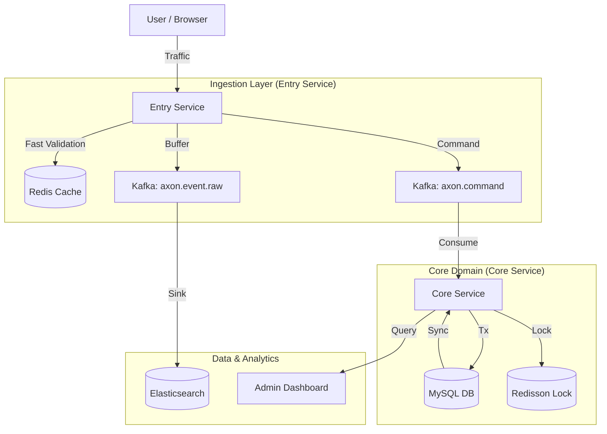

# Axon: High-Performance Campaign Intelligence Platform

> **Scale-ready, Event-driven Architecture for FCFS Commerce & Marketing Analytics**

Axon is a specialized commerce platform designed to handle massive traffic spikes typical of **"First-Come, First-Served" (FCFS)** events. It orchestrates high-concurrency reservations, processes real-time user behavior logs, and provides deep marketing insights through Cohort Analysis and LTV metrics.

---

## Key Features

### High-Concurrency Traffic Control
- **Deterministic FCFS**: Guarantees 100% data consistency even under thousands of concurrent requests using **Redisson Distributed Locks** and **Redis Atomic Counters**.
- **Zero-Overbooking**: Strict inventory management with a "Check-then-Act" protection mechanism.
- **Spike Buffering**: Entry Service acts as a shock absorber, buffering requests into Kafka before they reach the core logic.

### Real-time Marketing Analytics
- **Full-Funnel Tracking**: Tracks user journey from `Visit` -> `Click` -> `Reservation` -> `Purchase`.
- **Cohort & LTV Analysis**: Analyzes user retention and Lifetime Value (LTV) over 30d/90d/365d periods.
- **Hybrid Data Pipeline**:
  - **Elasticsearch**: For massive behavior log aggregation and real-time dashboarding.
  - **MySQL**: For transactional integrity and precise financial metrics.

### Modern Engineering
- **Virtual Threads (JDK 21)**: Migrated from Reactive Streams to Virtual Threads for high throughput with simpler debugging.
- **Event-Driven Architecture**: Decoupled microservices via Kafka (KRaft mode).
- **Observability**: Full stack monitoring with Prometheus, Grafana, and Kibana.

---

## System Architecture



| Module | Description | Tech Stack |
| --- | --- | --- |
| **`entry-service`** | Traffic gateway. Handles validation, FCFS reservation, and behavior logging. | Spring Boot, Netty, Redis, Kafka |
| **`core-service`** | Domain engine. Manages products, campaigns, purchases, and analytics. | Spring Boot (Virtual Threads), JPA, Redisson |
| **`common-messaging`** | Shared DTOs, Enums, and Kafka constants. | Java Library |
| **`infrastructure`** | Deployment configurations and scripts. | Docker, K8s, Helm |

---

## Tech Stack

- **Language**: Java 21 (LTS)
- **Framework**: Spring Boot 3.2, Spring Cloud
- **Messaging**: Apache Kafka (KRaft mode)
- **Database**: MySQL 8.0, Redis (Cluster/Sentinel ready), Elasticsearch 8.x
- **DevOps**: Docker Compose, Kubernetes (K2P), GitHub Actions
- **Testing**: JUnit 5, k6 (Load Testing), Shell Scripts (E2E Simulation)

---

## Getting Started

### Prerequisites
- Java 21+
- Docker & Docker Compose

### 1. Start Infrastructure
Spin up Kafka, MySQL, Redis, and Elasticsearch.
```bash
docker-compose up -d
```

### 2. Run Services
**Entry Service (Port 8081)**
```bash
./gradlew :entry-service:bootRun
```

**Core Service (Port 8080)**
```bash
./gradlew :core-service:bootRun
```

### 3. Access Dashboard
Navigate to `http://localhost:8080/admin/dashboard/1` to view the real-time marketing dashboard.

---

## Testing & Simulation

Axon includes a powerful simulation suite to verify complex scenarios.

| Script | Purpose |
| --- | --- |
| `run-dashboard-test.sh` | Generates a full user journey (Visit -> Purchase) and populates the dashboard. |
| `generate-ltv-simulation.sh` | Simulates future repurchases (30d/90d/365d) for Cohort/LTV analysis. |
| `time-travel-activity.sh` | Moves campaign dates to the past to test expired/historical scenarios. |

**Example: Run a full test**
```bash
# Generate 100 visitors for Activity ID 1
./core-service/scripts/run-dashboard-test.sh 1 100
```

---

## Performance Engineering

### Concurrency Control
We addressed the "Over-booking" issue in FCFS events by implementing **Redisson Distributed Locks**.
- **Before**: Database `check-then-act` caused race conditions under load.
- **After**: `RLock` ensures atomic reservations across distributed instances.

### Throughput Optimization
- **WebFlux -> Virtual Threads**: Replaced complex reactive chains with blocking-style Virtual Threads, improving throughput while maintaining code readability.
- **Async Event Publishing**: ApplicationEvents + Kafka ensures the main transaction is never blocked by logging or notification tasks.

---

## Documentation
- [Behavior Tracker Spec](docs/behavior-tracker.md)
- [Marketing Dashboard Plan](docs/marketing-dashboard-development-plan.md)
- [Performance Improvement Plan](docs/performance-improvement-plan.md)

---

**Axon Team** | *Built for Scale, Designed for Insight.*
