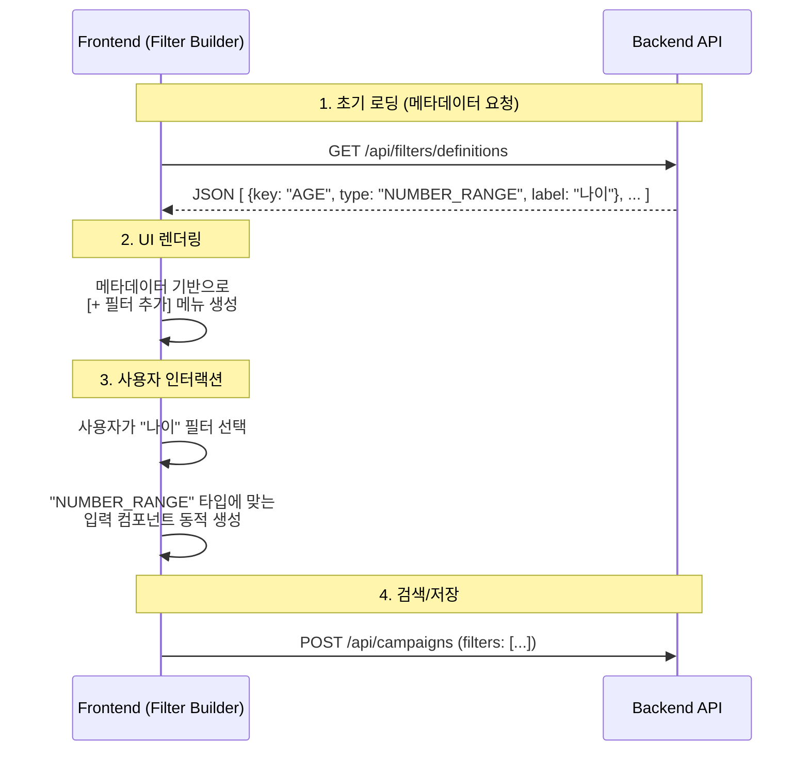

# 확장 가능한 필터 시스템 가이드: 필터 빌더 (Filter Builder) 패턴

## 1. 배경 및 문제점
현재의 **체크박스 나열 방식**은 필터가 5~10개일 때는 직관적이지만, 50개 이상으로 늘어나면 다음과 같은 문제가 발생합니다.
*   **공간 부족**: 화면 스크롤이 길어지고 복잡해 보임.
*   **성능 저하**: 사용하지 않는 필터의 DOM 요소까지 모두 렌더링해야 함.
*   **확장성 한계**: 새로운 필터를 추가할 때마다 HTML과 JS를 모두 수정해야 함.

이를 해결하기 위해 Jira, Notion, Linear 등 최신 SaaS 툴에서 채택하는 **'필터 빌더(Filter Builder)'** 패턴을 제안합니다.

---

## 2. UI/UX 컨셉 (Visual Examples)

이 패턴의 핵심은 **"필요한 필터만 그때그때 추가해서 쓴다"**는 것입니다.

### 2.1. 초기 상태 (Initial State)
화면에는 기본적으로 아무런 필터 입력창이 없거나, 가장 자주 쓰이는 1~2개만 노출됩니다. 대신 눈에 띄는 **[+ 필터 추가]** 버튼이 존재합니다.

```text
+-------------------------------------------------------+
|  [검색어 입력...]                                     |
|                                                       |
|  [ + 필터 추가 ]                                      |
|                                                       |
|  (리스트 영역...)                                     |
+-------------------------------------------------------+
```

### 2.2. 필터 선택 (Filter Selection)
버튼을 누르면 검색 가능한 드롭다운 메뉴가 뜹니다. 여기서 원하는 조건을 찾습니다.

```text
+-------------------------------------------------------+
|  [검색어 입력...]                                     |
|                                                       |
|  [ + 필터 추가 ]                                      |
|  +---------------------------+                        |
|  | 🔍 구매                   |                        |
|  +---------------------------+                        |
|  | 최근 구매 이력            |                        |
|  | 총 구매 금액              |                        |
|  | 장바구니 담은 상품        |                        |
|  +---------------------------+                        |
|                                                       |
+-------------------------------------------------------+
```

### 2.3. 필터 적용 상태 (Active Filters)
선택한 필터만 화면에 "행(Row)" 또는 "칩(Chip)" 형태로 추가됩니다.

```text
+-------------------------------------------------------+
|  [검색어 입력...]                                     |
|                                                       |
|  v [최근 구매 이력] [기간(BETWEEN)] [2024-01-01] ~ [2024-12-31] (x) |
|  v [회원 등급]     [포함(IN)]      [VIP, VVIP]              (x) |
|                                                       |
|  [ + 필터 추가 ]                                      |
+-------------------------------------------------------+
```

---

## 3. 기술 구현 아키텍처 (Technical Architecture)

이 구조를 지탱하기 위해 프론트엔드와 백엔드는 **"메타데이터(Metadata)"** 기반으로 통신해야 합니다.

### 3.1. 데이터 흐름도 (Mermaid)



### 3.2. 핵심 컴포넌트 설계

#### A. Filter Registry (프론트엔드)
현재 구현하신 `FilterRegistry`를 조금 더 발전시켜, **"필터 이름"**이 아닌 **"입력 타입"**별로 핸들러를 관리합니다.

```javascript
// FilterTypeRegistry: 입력 UI의 '모양'을 결정
const FilterTypeRegistry = {
    'NUMBER_RANGE': NumberRangeHandler, // 숫자 범위 (예: 나이, 금액)
    'DATE_RANGE': DateRangeHandler,     // 날짜 범위 (예: 가입일, 구매일)
    'SELECT': SelectHandler,            // 목록 선택 (예: 등급, 지역)
    'TEXT': TextHandler                 // 텍스트 검색 (예: 이름)
};

// 메타데이터 예시 (백엔드에서 수신)
const filterDefinitions = [
    { key: 'AGE', label: '나이', type: 'NUMBER_RANGE' },
    { key: 'PURCHASE_DATE', label: '최근 구매일', type: 'DATE_RANGE' },
    { key: 'VIP_TIER', label: '회원 등급', type: 'SELECT', options: ['VIP', 'GOLD'] }
];
```

#### B. Backend Strategy (백엔드)
백엔드는 이미 `ValidationLimitStrategy` 패턴이 잘 잡혀 있습니다. 여기에 **메타데이터 제공 인터페이스**만 추가하면 됩니다.

```java
public interface ValidationLimitStrategy {
    // 기존 검증 로직
    boolean validate(...);
    
    // [New] 프론트엔드용 메타데이터 반환
    FilterDefinitionDto getDefinition(); 
    // 예: return new FilterDefinitionDto("AGE", "나이", FilterType.NUMBER_RANGE);
}
```

---

## 4. 단계별 도입 로드맵

1.  **1단계 (현재 완료)**: `FilterRegistry` 도입으로 코드 모듈화. (하드코딩된 UI 유지)
2.  **2단계 (UI 개선)**: 체크박스 나열 UI를 **[+ 필터 추가]** 버튼과 동적 리스트 UI로 변경. (아직 메타데이터는 하드코딩)
3.  **3단계 (Server-Driven)**: 백엔드에서 필터 목록을 API로 내려주고, 프론트엔드는 이를 받아 자동으로 메뉴를 구성하도록 전환.

이 문서가 향후 시스템 확장에 도움이 되기를 바랍니다.
