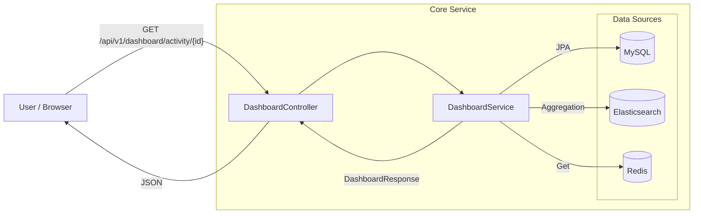

# LLM-based Dashboard Query Architecture

## 1. Current Architecture (Standard Dashboard)
Currently, the frontend directly calls specific REST endpoints to fetch pre-defined data structures.



## 2. New Architecture (With LLM Query Interface)
We are adding a **Semantic Layer** (`LLMQueryService`) that sits between the user's natural language and the existing `DashboardService`.

```mermaid
graph LR
    User[User / Browser]
    
    subgraph "Core Service"
        QueryController[DashboardQueryController]
        LLMService[LLMQueryService]
        DashService[DashboardService]
        
        subgraph "External"
            LLM[LLM Provider\n(e.g., OpenAI/Mock)]
        end
        
        subgraph "Data Sources"
            MySQL[(MySQL)]
            ES[(Elasticsearch)]
            Redis[(Redis)]
        end
    end

    %% New Flow
    User -- "POST /query\n'How many visits?'" --> QueryController
    QueryController --> LLMService
    
    %% LLM Interaction
    LLMService -- "Prompt: Parse 'How many visits?'" --> LLM
    LLM -- "Intent: GET_METRIC\nMetric: VISITS" --> LLMService
    
    %% Internal Mapping
    LLMService -- "getStepCount(VISIT)" --> DashService
    
    %% Existing Flow Reuse
    DashService --> MySQL
    DashService --> ES
    DashService --> Redis
    
    %% Response
    DashService --> LLMService
    LLMService -- "Natural Language Answer" --> QueryController
    QueryController -- "JSON {answer, data}" --> User
```

## 3. Key Components Added

### A. `DashboardQueryController` (Interface Layer)
- **Role**: Receives natural language requests from the frontend.
- **Endpoint**: `POST /api/v1/dashboard/campaign/{id}/query`

### B. `LLMQueryService` (Semantic Layer) - **THIS IS THE MAIN ADDITION**
- **Role**: Translates natural language into executable code/method calls.
- **Responsibilities**:
    1. **Intent Recognition**: What does the user want? (Data fetch, Explanation, Action?)
    2. **Parameter Extraction**: Which metric? What date range? Which campaign?
    3. **Service Orchestration**: Calls existing `DashboardService` methods.
    4. **Response Generation**: Formats the raw data back into a human-readable sentence.

### C. `DashboardService` (Existing Data Layer)
- **Role**: Remains the "Source of Truth" for data fetching.
- **Benefit**: The LLM doesn't generate SQL/ES queries directly (reducing hallucination/security risks). It calls trusted Java methods.
