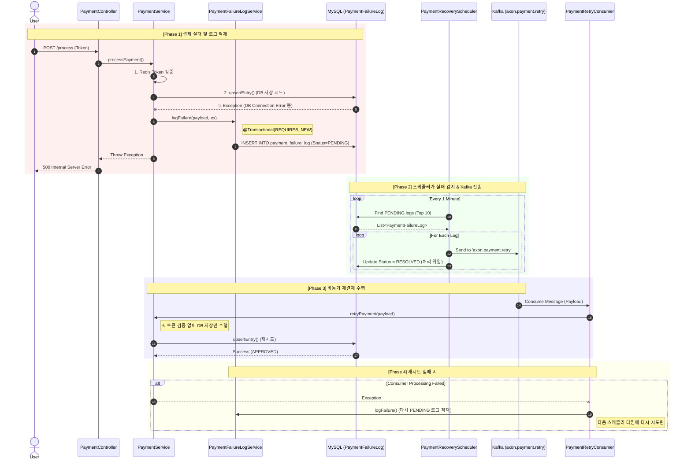

# 결제 시스템 장애 대응 및 복구 아키텍처 (Payment Resilience Architecture)

> **작성일**: 2026-01-13
> **적용 서비스**: `core-service`
> **목적**: 결제 프로세스 중 DB 장애나 일시적 오류 발생 시 데이터 유실을 방지하고 자동 복구(Retry)하는 메커니즘 기술

---

## 1. 개요 (Overview)

Core Service로 이관된 결제 시스템은 **Stateful**한 구조를 가집니다. 결제 요청(`PaymentController`)은 동기적으로 처리되지만, DB 저장 단계(`upsertEntry`)에서 실패할 경우 데이터 불일치가 발생할 수 있습니다.

이를 해결하기 위해 **Transactional Outbox Pattern**과 **Kafka Async Retry**를 결합한 하이브리드 장애 대응 시스템을 구축했습니다.

### 핵심 전략
1.  **실패 격리 (Isolation):** 메인 트랜잭션이 롤백되어도 실패 이력은 별도 트랜잭션으로 반드시 저장합니다.
2.  **지수 백오프 (Exponential Backoff):** 재시도 횟수에 따라 대기 시간을 늘려 DB 부하를 조절합니다.
3.  **비동기 처리 (Async Processing):** 스케줄러와 Kafka를 통해 재시도 로직을 메인 스레드와 분리합니다.

---

## 2. 아키텍처 다이어그램 (Architecture)

### 2.1. 전체 데이터 흐름 (Sequence Diagram)



---

## 3. 데이터 모델 (Data Model)

### 3.1. PaymentFailureLog (Entity)
실패한 결제 요청의 "스냅샷"을 저장하는 테이블입니다.

```sql
CREATE TABLE payment_failure_log (
    id BIGINT AUTO_INCREMENT PRIMARY KEY,
    user_id BIGINT NOT NULL,
    payload TEXT NOT NULL,              -- 결제 요청 데이터 (JSON)
    error_message TEXT NOT NULL,        -- 실패 원인
    status VARCHAR(20) NOT NULL,        -- PENDING, PROCESSING, RESOLVED, FAILED
    retry_count INT DEFAULT 0,          -- 현재 재시도 횟수
    next_retry_at DATETIME NOT NULL,    -- 다음 실행 예정 시간
    created_at DATETIME,
    updated_at DATETIME,
    
    INDEX idx_status_next_retry (status, next_retry_at) -- 스케줄러 조회용 인덱스
);
```

### 3.2. 상태 전이 (State Transition)
- **`PENDING`**: 최초 실패 시 또는 재시도 대기 상태.
- **`PROCESSING`**: 스케줄러가 Kafka로 전송 중인 상태.
- **`RESOLVED`**: Kafka 전송 완료 (이후 처리는 Consumer에게 위임).
- **`FAILED`**: 최대 재시도 횟수(5회) 초과 시 영구 실패 처리.

---

## 4. 주요 컴포넌트 상세

### A. PaymentService (Core Logic)
- **`processPayment(token)`**: 일반 결제 흐름. Redis 토큰 유효성을 검사하고 DB에 저장합니다. 실패 시 `logFailure`를 호출하고 예외를 던집니다.
- **`retryPayment(payload)`**: 재시도 흐름. **Redis 토큰 검증을 생략**하고 `executePayment`를 호출하여 강제로 DB 저장을 시도합니다. (이미 이전에 검증된 요청이기 때문)

### B. PaymentFailureLogService (Outbox Logger)
- **`@Transactional(propagation = Propagation.REQUIRES_NEW)`**
- 메인 비즈니스 로직의 트랜잭션 롤백 여부와 관계없이, 실패 로그를 반드시 커밋하여 데이터 유실을 방지합니다.

### C. PaymentRecoveryScheduler (Dispatcher)
- **주기**: 1분 (`fixedDelay = 60000`)
- **역할**: `PENDING` 상태이면서 `nextRetryAt`이 도래한 로그를 조회하여 Kafka `axon.payment.retry` 토픽으로 발행합니다.
- **확장성**: 직접 처리하지 않고 Kafka로 넘김으로써, 다수의 Core Service 파드(Consumer)가 부하를 분산 처리할 수 있게 합니다.

### D. PaymentRetryConsumer (Worker)
- **Topic**: `axon.payment.retry`
- **역할**: 메시지를 받아 `paymentService.retryPayment()`를 호출합니다.
- **실패 대응**: 여기서도 실패할 경우, 다시 `PaymentFailureLogService`를 호출하여 새로운 `PENDING` 로그를 생성합니다. (사실상 무한 루프 재시도 구조이나, `retryCount` 로직을 통해 5회 제한)

---

## 5. 재시도 정책 (Retry Policy)

### 지수 백오프 (Exponential Backoff)
DB 장애가 지속될 경우를 대비해 재시도 간격을 점진적으로 늘립니다.

- **1회차**: 즉시 (또는 1분 후)
- **2회차**: +2분 후
- **3회차**: +4분 후
- **4회차**: +8분 후
- **5회차**: +16분 후
- **초과 시**: `FAILED` 상태로 변경 및 관리자 알림 대상이 됨.

---

## 6. 운영 및 모니터링 포인트

1.  **Dead Letter Queue (DLQ) 모니터링**:
    - `payment_failure_log` 테이블에서 `status = 'FAILED'`인 건이 발생하는지 주기적으로 확인해야 합니다.
2.  **Kafka Lag**:
    - `axon.payment.retry` 토픽의 컨슈머 랙(Lag)이 쌓이지 않는지 확인해야 합니다.
3.  **수동 복구**:
    - `FAILED` 상태의 로그는 관리자가 원인 파악 후(예: 데이터 정합성 오류), `PENDING`으로 상태를 강제 변경하여 재시도를 유도할 수 있습니다.
